# ZeroDev/BuildFixAgents - Complete Agent Guide v2.0

## Table of Contents
1. [Overview](#overview)
2. [Agent Architecture](#agent-architecture)
3. [Core Build Fix Agents](#core-build-fix-agents)
4. [Development Agents](#development-agents)
5. [Specialized Fix Agents](#specialized-fix-agents)
6. [Quality Assurance Agents](#quality-assurance-agents)
7. [Project Management Agents](#project-management-agents)
8. [Infrastructure & Operations Agents](#infrastructure--operations-agents)
9. [Feature Implementation Agents](#feature-implementation-agents)
10. [Analysis & Monitoring Agents](#analysis--monitoring-agents)
11. [Security & Compliance Agents](#security--compliance-agents)
12. [AI & Learning Agents](#ai--learning-agents)
13. [System Integration Agents](#system-integration-agents)
14. [Advanced Feature Agents](#advanced-feature-agents)
15. [Enterprise & Production Agents](#enterprise--production-agents)
16. [Utility & Support Agents](#utility--support-agents)
17. [Agent Communication](#agent-communication)
18. [Usage Examples](#usage-examples)
19. [Best Practices](#best-practices)
20. [Troubleshooting](#troubleshooting)

## Overview

The ZeroDev/BuildFixAgents system is a comprehensive multi-agent AI development platform featuring **90+ specialized agents** that automate various aspects of software development, from initial project creation to deployment and optimization. Each agent specializes in specific tasks while working together to create a complete development ecosystem.

### Key Features
- **90+ Specialized Agents**: Covering every aspect of modern software development
- **Parallel Execution**: Advanced coordinators run multiple agents simultaneously
- **Self-Improving**: System learns from each interaction and improves over time
- **Full Stack Coverage**: From database design to frontend, deployment to monitoring
- **Enterprise Ready**: Production-grade features with security and compliance

## Agent Architecture

### Hierarchical Structure (Updated)
```
Level 5: Strategic Control
├── god_mode_controller.sh - Master system control
└── visionary_agent_buildfix.sh - Strategic system oversight

Level 4: Visionary & Management
├── visionary_agent.sh - Strategic vision planning
├── project_manager_agent.sh - Project coordination
├── product_owner_agent.sh - Product vision
└── business_analyst_agent.sh - Requirements analysis

Level 3: Advanced Coordinators
├── production_coordinator.sh - Production-ready orchestration (RECOMMENDED)
├── unified_coordinator.sh - Unified coordinator with 6 modes
├── master_fix_coordinator.sh - Master fix orchestration (sequential) [LEGACY]
├── generic_agent_coordinator.sh - Multi-agent orchestration (parallel) [LEGACY]
├── enhanced_coordinator.sh - Advanced coordination (hybrid) [LEGACY]
├── enhanced_coordinator_v2.sh - Enhanced v2 coordination
├── multi_agent_coordinator.sh - Multi-agent management
├── distributed_coordinator.sh - Distributed system coordination
├── enterprise_orchestration.sh - Enterprise-level orchestration
└── scrum_master_agent.sh - Sprint and task management

Level 2: Specialist Agents (60+ agents)
├── Development Agents (15+)
├── QA & Testing Agents (8+)
├── Infrastructure Agents (10+)
├── Security Agents (5+)
├── AI/ML Agents (8+)
├── Integration Agents (8+)
├── Feature Agents (10+)
└── Utility Agents (10+)

Level 1: Core Fix Agents
├── generic_error_agent.sh - General error resolution
├── generic_build_analyzer.sh - Build analysis
├── fix_agent_buildanalyzer.sh - Build analysis fixes
├── fix_agent_errorcounting.sh - Error tracking fixes
└── unified_error_counter.sh - Unified error counting
```

### Updated Agent Interaction Flow Chart

```mermaid
graph TB
    %% Master Control
    GOD[God Mode Controller] -->|Strategic Control| VIS[Visionary Agents]
    
    %% Visionary Layer
    VIS -->|Vision| PM[Project Manager]
    VIS -->|Strategy| VO[Visionary BuildFix]
    
    %% Coordinators - Parallel Execution
    PM -->|Parallel Coord| PAR{Parallel Coordinators}
    PAR -->|3 agents max| GAC[Generic Agent Coordinator]
    PAR -->|Hybrid| EC[Enhanced Coordinator]
    PAR -->|Sequential| MFC[Master Fix Coordinator]
    PAR -->|Distributed| DC[Distributed Coordinator]
    PAR -->|Enterprise| EO[Enterprise Orchestration]
    
    %% Product Development
    PM -->|Product| PO[Product Owner]
    PO -->|Requirements| BA[Business Analyst]
    BA -->|Stories| USA[User Story Agent]
    BA -->|Planning| SP[Sprint Planning]
    SP -->|Execution| SM[Scrum Master]
    
    %% Development Teams (Parallel)
    subgraph "Development Teams (Parallel Execution)"
        GAC -->|Deploy| DEV1[Dev Agent Core]
        GAC -->|Deploy| DEV2[Dev Agent Integration]
        GAC -->|Deploy| DEV3[Dev Agent Patterns]
        GAC -->|Deploy| DEV4[CodeGen Developer]
        GAC -->|Deploy| ARCH1[Architect Agent]
        GAC -->|Deploy| ARCH2[Architect Agent V2]
    end
    
    %% Specialized Fix Agents (Parallel)
    subgraph "Fix Specialists (Parallel)"
        EC -->|CS0101| FIX1[Duplicate Resolver]
        EC -->|Constraints| FIX2[Constraints Specialist]
        EC -->|Inheritance| FIX3[Inheritance Specialist]
        EC -->|Multi-Lang| MLF[Multi-Language Fix]
        EC -->|AI| AIF[AI Powered Fixer]
    end
    
    %% QA Teams (Parallel)
    subgraph "QA Teams (Parallel)"
        SM -->|Testing| QA1[QA Agent Final]
        SM -->|Automation| QA2[QA Automation]
        SM -->|Management| QA3[QA Test Manager]
        SM -->|Testing| TEST1[Tester Agent]
        SM -->|Enhanced| TEST2[Testing Agent V2]
    end
    
    %% Infrastructure (Parallel)
    subgraph "Infrastructure (Parallel)"
        EO -->|Deploy| DEPLOY[Deployment Agent]
        EO -->|Database| DB[Database Agent]
        EO -->|Container| K8S[Container/K8s Support]
        EO -->|Hardware| HW[Hardware Detector]
        EO -->|Monitoring| MON[Monitoring Agent]
    end
    
    %% AI/ML Pipeline (Parallel)
    subgraph "AI/ML Pipeline (Parallel)"
        DC -->|Learning| LEARN[Learning Agent]
        DC -->|Patterns| PL[Pattern Learner]
        DC -->|Generate| PG[Pattern Generator]
        DC -->|Validate| PV[Pattern Validator]
        DC -->|AI| AI[AI Integration]
        DC -->|ML| ML[ML Integration Layer]
        DC -->|Feedback| FB[Feedback Loop Agent]
    end
    
    %% Security & Compliance (Parallel)
    subgraph "Security (Parallel)"
        EO -->|Security| SEC[Security Agent]
        EO -->|Advanced| ASS[Advanced Security Suite]
        EO -->|Quantum| QRS[Quantum Resistant Security]
        EO -->|Compliance| CAF[Compliance Audit Framework]
    end
    
    %% Integration Hub
    subgraph "Integrations"
        DC -->|Hub| IH[Integration Hub]
        IH -->|Git| GIT[Git Integration]
        IH -->|IDE| IDE[IDE Integration]
        IH -->|Claude| CC[Claude Code Integration]
        IH -->|Plugins| PLG[Plugin Manager]
        IH -->|Config| CFG[Config Manager]
    end
    
    %% Advanced Features
    subgraph "Advanced Features"
        EO -->|Analytics| AA[Advanced Analytics]
        EO -->|Cache| ACS[Advanced Caching System]
        EO -->|Patterns| APE[Advanced Pattern Engine]
        EO -->|Knowledge| KMS[Knowledge Management]
        EO -->|Realtime| RTC[Realtime Collaboration]
        EO -->|Edge| EC2[Edge Computing Support]
    end
    
    %% Monitoring & Feedback
    MON -->|Metrics| MC[Metrics Collector]
    MON -->|Performance| PERF1[Performance Agent]
    MON -->|Enhanced| PERF2[Performance Agent V2]
    MON -->|Telemetry| TEL[Telemetry Collector]
    
    %% Dashboards
    MC -->|Visual| DASH[Dashboard]
    MC -->|Web| WD[Web Dashboard]
    MC -->|Testing| ABT[AB Testing Framework]
    
    %% Error Resolution Flow
    ALL[All Agents] -->|Errors| GEA[Generic Error Agent]
    GEA -->|Analysis| GBA[Generic Build Analyzer]
    GBA -->|Fixes| FBA[Fix Build Analyzer]
    GBA -->|Count| UEC[Unified Error Counter]
    
    %% Disaster Recovery
    GOD -->|Emergency| DR[Disaster Recovery]
    DR -->|Logs| ELS[Enhanced Logging System]
    
    style GOD fill:#f00,stroke:#333,stroke-width:4px
    style VIS fill:#ff9,stroke:#333,stroke-width:4px
    style PAR fill:#9ff,stroke:#333,stroke-width:4px
    style ALL fill:#fcc,stroke:#333,stroke-width:2px
```



### Execution Patterns

#### Sequential Execution (Slower)
- **master_fix_coordinator.sh**: Runs agents one at a time
- Used for: Dependent tasks, ordered operations

#### Parallel Execution (Faster)
- **generic_agent_coordinator.sh**: Up to 3 agents simultaneously
- **enhanced_coordinator.sh**: Hybrid approach with parallel phases
- **distributed_coordinator.sh**: Distributed parallel execution
- Used for: Independent tasks, performance optimization

#### Recommended Usage
```bash
# For parallel execution (faster)
./enhanced_coordinator.sh

# For specific parallel limits
./generic_agent_coordinator.sh  # 3 agents max

# For sequential when order matters
./master_fix_coordinator.sh
```

## Core Build Fix Agents

### 1. Production Coordinator (`production_coordinator.sh`) - RECOMMENDED
**Execution**: Priority-based parallel with dependency resolution
**Purpose**: Enterprise-grade orchestration with production features

**Key Features**:
- Priority-based scheduling (7 levels)
- Automatic dependency resolution
- Retry logic with exponential backoff
- Health monitoring and recovery
- Checkpointing for resume capability
- Resource-aware concurrency (2-12 agents)
- Structured JSON logging
- Comprehensive reporting
- Dry-run mode for testing

**Performance**: 2-5 minutes typical (vs 15-20 sequential)

### 2. Unified Coordinator (`unified_coordinator.sh`)
**Execution**: Multiple modes (smart, parallel, sequential, phase, full, minimal)
**Purpose**: Flexible coordinator combining features from legacy coordinators

**Modes**:
- **smart**: Adapts based on error count
- **parallel**: Maximum concurrency
- **sequential**: One at a time
- **phase**: Sequential phases with parallel execution
- **full**: Deploy all agents
- **minimal**: Essential agents only

### 3. Legacy Coordinators (Use only if needed)

#### Master Fix Coordinator (`master_fix_coordinator.sh`) - LEGACY
**Execution**: Sequential only
**Status**: Replaced by production_coordinator.sh

#### Generic Agent Coordinator (`generic_agent_coordinator.sh`) - LEGACY
**Execution**: Limited parallel (3 agents max)
**Status**: Replaced by production_coordinator.sh

#### Enhanced Coordinator (`enhanced_coordinator.sh`) - LEGACY
**Execution**: Hybrid approach
**Status**: Replaced by production_coordinator.sh

### 4. Generic Build Analyzer (`generic_build_analyzer.sh`)
Analyzes build output and categorizes errors.

### 5. Generic Error Agent (`generic_error_agent.sh`)
Handles general error resolution across languages.

### 6. Unified Error Counter (`unified_error_counter.sh`)
Provides consistent error counting across all components.

## Production Coordinator Features

### Why Use Production Coordinator?

The production coordinator is the recommended orchestrator for all BuildFixAgents operations:

1. **Intelligent Scheduling**
   - Priority-based execution (7 levels)
   - Dependency resolution ensures correct order
   - Parallel execution within priority groups
   - Dynamic concurrency based on system resources

2. **Production Reliability**
   - Automatic retry with exponential backoff
   - Health monitoring detects stuck agents
   - Checkpointing for resume capability
   - Graceful shutdown and cleanup

3. **Observability**
   - Structured JSON logging
   - Real-time metrics tracking
   - Comprehensive execution reports
   - Performance analytics per agent

4. **Resource Management**
   - CPU/Memory/Disk monitoring
   - Adaptive concurrency limits
   - Container/VM awareness
   - Resource-based throttling

### Production Coordinator Usage

```bash
# Basic usage (recommended)
./production_coordinator.sh

# Dry run to preview execution
./production_coordinator.sh --dry-run

# Custom settings
./production_coordinator.sh parallel \
  --max-agents 10 \
  --timeout 600 \
  --retry 5

# Resume from checkpoint
./production_coordinator.sh --restore checkpoint.json

# Minimal mode for quick fixes
./production_coordinator.sh minimal --no-metrics
```

### Agent Priority System

| Priority | Agent Type | Examples |
|----------|------------|----------|
| 1 | Core Analysis | Build Analyzer, Error Counter |
| 2 | Error Analysis | Error Agent, Code Analysis |
| 3 | Architecture | Architect Agent, Planning |
| 4 | Development | Core Dev, Integration, Patterns |
| 5 | Fix Specialists | Duplicate, Constraints, Inheritance |
| 6 | QA Testing | QA Automation, Testing |
| 7 | Final Validation | QA Final, Deployment Prep |

## Development Agents

### Core Development
1. **Dev Agent Core Fix** (`dev_agent_core_fix.sh`) - Core development fixes
2. **Dev Agent Integration** (`dev_agent_integration.sh`) - Integration development
3. **Dev Agent Patterns** (`dev_agent_patterns.sh`) - Pattern-based development
4. **Dev Agent State** (`dev_agent_state.sh`) - State management for development
5. **CodeGen Developer Agent** (`codegen_developer_agent.sh`) - Code generation

### Architecture Agents
6. **Architect Agent** (`architect_agent.sh`) - Architecture decisions
7. **Architect Agent V2** (`architect_agent_v2.sh`) - Enhanced architecture planning

### Language Pattern Agents
8. **C++ Patterns** (`cpp_patterns.sh`) - C++ specific patterns
9. **C# Patterns** (`csharp_patterns.sh`) - C# specific patterns
10. **Go Patterns** (`go_patterns.sh`) - Go specific patterns
11. **Java Patterns** (`java_patterns.sh`) - Java specific patterns
12. **JavaScript Patterns** (`javascript_patterns.sh`) - JavaScript patterns
13. **Python Patterns** (`python_patterns.sh`) - Python specific patterns
14. **Ruby Patterns** (`ruby_patterns.sh`) - Ruby specific patterns
15. **Rust Patterns** (`rust_patterns.sh`) - Rust specific patterns
16. **SQL Patterns** (`sql_patterns.sh`) - SQL query patterns
17. **PHP Patterns** (`php_patterns.sh`) - PHP specific patterns
18. **HTML/CSS Patterns** (`html_css_patterns.sh`) - Frontend patterns

## Specialized Fix Agents

1. **Agent1 Duplicate Resolver** (`agent1_duplicate_resolver.sh`) - Resolves CS0101 duplicate definitions
2. **Agent2 Constraints Specialist** (`agent2_constraints_specialist.sh`) - Handles constraint issues
3. **Agent3 Inheritance Specialist** (`agent3_inheritance_specialist.sh`) - Fixes inheritance problems
4. **Multi-Language Fix Agent** (`multi_language_fix_agent.sh`) - Cross-language fixes
5. **AI Powered Fixer** (`ai_powered_fixer.sh`) - AI-enhanced error resolution
6. **Direct Fix** (`direct_fix.sh`) - Direct error fixes
7. **Safe Fix** (`safe_fix.sh`) - Safe fixing with validation
8. **Quick Fix CS0101** (`quick_fix_cs0101.sh`) - Quick duplicate fixes

## Quality Assurance Agents

1. **QA Agent Final** (`qa_agent_final.sh`) - Final QA validation
2. **QA Automation Agent** (`qa_automation_agent.sh`) - Automated test generation
3. **QA Test Manager** (`qa_test_manager.sh`) - Test suite management
4. **Tester Agent** (`tester_agent.sh`) - Basic testing functionality
5. **Testing Agent V2** (`testing_agent_v2.sh`) - Enhanced testing capabilities
6. **Build Checker Agent** (`build_checker_agent.sh`) - Build validation

## Project Management Agents

1. **Project Manager Agent** (`project_manager_agent.sh`) - Project coordination
2. **Scrum Master Agent** (`scrum_master_agent.sh`) - Sprint management
3. **Product Owner Agent** (`product_owner_agent.sh`) - Product vision
4. **Business Analyst Agent** (`business_analyst_agent.sh`) - Requirements analysis
5. **Sprint Planning Agent** (`sprint_planning_agent.sh`) - Sprint planning
6. **User Story Agent** (`user_story_agent.sh`) - User story management
7. **Roadmap Agent** (`roadmap_agent.sh`) - Product roadmap
8. **Requirements Agent** (`requirements_agent.sh`) - Requirements gathering
9. **Feedback Loop Agent** (`feedback_loop_agent.sh`) - Continuous feedback

## Infrastructure & Operations Agents

### Deployment & Infrastructure
1. **Deployment Agent** (`deployment_agent.sh`) - Deployment automation
2. **Fix Agent Deployment** (`fix_agent_deployment.sh`) - Agent deployment fixes
3. **Container Kubernetes Support** (`container_kubernetes_support.sh`) - K8s integration
4. **Hardware Detector** (`hardware_detector.sh`) - Hardware capabilities detection
5. **Distributed Coordinator** (`distributed_coordinator.sh`) - Distributed systems

### Database & Storage
6. **Database Agent** (`database_agent.sh`) - Database operations
7. **Advanced Caching System** (`advanced_caching_system.sh`) - Caching infrastructure

### Monitoring & Performance
8. **Monitoring Agent** (`monitoring_agent.sh`) - System monitoring
9. **Performance Agent** (`performance_agent.sh`) - Performance analysis
10. **Performance Agent V2** (`performance_agent_v2.sh`) - Enhanced performance
11. **Metrics Collector Agent** (`metrics_collector_agent.sh`) - Metrics collection
12. **Telemetry Collector** (`telemetry_collector.sh`) - Telemetry data

## Feature Implementation Agents

1. **Feature Implementation Agent** (`feature_implementation_agent.sh`) - Feature development
2. **API Design Agent** (`api_design_agent.sh`) - API specification
3. **Frontend Agent** (`frontend_agent.sh`) - UI component generation
4. **Documentation Agent** (`documentation_agent.sh`) - Documentation generation
5. **Refactoring Agent** (`refactoring_agent.sh`) - Code refactoring
6. **Dependency Agent** (`dependency_agent.sh`) - Dependency management
7. **Accessibility Agent** (`accessibility_agent.sh`) - WCAG compliance
8. **Project Generator Agent** (`project_generator_agent.sh`) - Project scaffolding

## Analysis & Monitoring Agents

1. **Analysis Agent** (`analysis_agent.sh`) - Code analysis
2. **Cost Optimization Agent** (`cost_optimization_agent.sh`) - Cost analysis
3. **Cost Optimization Engine** (`cost_optimization_engine.sh`) - Cost reduction engine
4. **Advanced Analytics** (`advanced_analytics.sh`) - Advanced analytics

## Security & Compliance Agents

1. **Security Agent** (`security_agent.sh`) - Security scanning
2. **Advanced Security Suite** (`advanced_security_suite.sh`) - Comprehensive security
3. **Quantum Resistant Security** (`quantum_resistant_security.sh`) - Quantum-safe algorithms
4. **Compliance Audit Framework** (`compliance_audit_framework.sh`) - Compliance checking

## AI & Learning Agents

1. **Learning Agent** (`learning_agent.sh`) - Machine learning integration
2. **Pattern Learner** (`pattern_learner.sh`) - Pattern recognition
3. **Pattern Generator** (`pattern_generator.sh`) - Pattern generation
4. **Pattern Validator** (`pattern_validator.sh`) - Pattern validation
5. **Pattern Database Manager** (`pattern_database_manager.sh`) - Pattern storage
6. **AI Integration** (`ai_integration.sh`) - AI system integration
7. **ML Integration Layer** (`ml_integration_layer.sh`) - ML framework integration
8. **Advanced Pattern Engine** (`advanced_pattern_engine.sh`) - Pattern processing

## System Integration Agents

1. **Integration Hub** (`integration_hub.sh`) - Central integration point
2. **Git Integration** (`git_integration.sh`) - Git operations
3. **IDE Integration** (`ide_integration.sh`) - IDE plugins
4. **Claude Code Integration** (`claude_code_integration.sh`) - Claude integration
5. **Plugin Manager** (`plugin_manager.sh`) - Plugin management
6. **Config Manager** (`config_manager.sh`) - Configuration management
7. **Language Detector** (`language_detector.sh`) - Language detection

## Advanced Feature Agents

1. **Knowledge Management System** (`knowledge_management_system.sh`) - Knowledge base
2. **Realtime Collaboration** (`realtime_collaboration.sh`) - Real-time features
3. **Edge Computing Support** (`edge_computing_support.sh`) - Edge deployment
4. **AB Testing Framework** (`ab_testing_framework.sh`) - A/B testing

## Enterprise & Production Agents

1. **Enterprise Launcher** (`enterprise_launcher.sh`) - Enterprise features v1
2. **Enterprise Launcher V2** (`enterprise_launcher_v2.sh`) - Enhanced enterprise v2
3. **Enterprise Launcher V3** (`enterprise_launcher_v3.sh`) - Latest enterprise v3
4. **Enterprise Orchestration** (`enterprise_orchestration.sh`) - Enterprise coordination
5. **Production Features** (`production_features.sh`) - Production-ready features
6. **Multi Agent Coordinator** (`multi_agent_coordinator.sh`) - Multi-agent management

## Utility & Support Agents

### System Utilities
1. **Notification System** (`notification_system.sh`) - Alert notifications
2. **Enhanced Logging System** (`enhanced_logging_system.sh`) - Advanced logging
3. **Dashboard** (`dashboard.sh`) - CLI dashboard
4. **Web Dashboard** (`web_dashboard.sh`) - Web-based dashboard

### Special Purpose
5. **God Mode Controller** (`god_mode_controller.sh`) - Master system control
6. **Disaster Recovery** (`disaster_recovery.sh`) - Emergency recovery
7. **Visionary Agent** (`visionary_agent.sh`) - Strategic planning
8. **Visionary Agent BuildFix** (`visionary_agent_buildfix.sh`) - BuildFix vision

## Agent Communication

### Execution Optimization

#### Parallel Execution Benefits
- **3-5x faster** than sequential execution
- Better resource utilization
- Independent task processing
- Scalable to available CPU cores

#### When to Use Each Coordinator
```bash
# RECOMMENDED - Production-ready with all features
./production_coordinator.sh  # Auto-adapts, retries, monitoring

# Alternative - Unified coordinator with modes
./unified_coordinator.sh smart  # 6 different modes

# LEGACY - Use only if specifically needed
./enhanced_coordinator.sh  # Old hybrid approach
./generic_agent_coordinator.sh  # Limited to 3 agents
./master_fix_coordinator.sh  # Sequential only

# Specialized coordinators
./distributed_coordinator.sh  # Multi-machine setup
./enterprise_orchestration.sh  # Enterprise features
```

### State Management
All agents share state through the `state/` directory with subdirectories for each agent type.

### Performance Metrics
- Sequential: ~30-60 seconds per agent
- Parallel (3 agents): ~10-20 seconds per batch
- Hybrid: Optimal based on hardware

## Usage Examples

### Example 1: Production Build Fix (Recommended)
```bash
# Standard production execution
./production_coordinator.sh

# Test execution plan without running
./production_coordinator.sh --dry-run

# Maximum parallelization
./production_coordinator.sh parallel --max-agents 10

# Minimal quick fix
./production_coordinator.sh minimal
```

### Example 2: Enterprise Deployment
```bash
# Full enterprise features with parallel execution
./enterprise_launcher_v3.sh --deploy production

# With orchestration
./enterprise_orchestration.sh --environment prod
```

### Example 3: AI-Powered Development
```bash
# Enable all AI features
./ai_integration.sh --enable-all
./ml_integration_layer.sh --models all
./pattern_learner.sh --learn-from-codebase
```

## Best Practices

### 1. Choose the Right Coordinator
- Use **production_coordinator.sh** for all production work (RECOMMENDED)
- Use **unified_coordinator.sh** for flexible execution modes
- Avoid legacy coordinators unless specifically required

### 2. Monitor Performance
```bash
# Check execution times
time ./enhanced_coordinator.sh

# Monitor agent status
watch -n 1 'cat state/coordinator/coordination_state.json | jq .agents'
```

### 3. Optimize Parallel Execution
- Set appropriate MAX_CONCURRENT_AGENTS based on CPU cores
- Use hardware_detector.sh to determine optimal settings
- Monitor system resources during execution

## Troubleshooting

### Slow Execution
**Problem**: Agents taking too long to complete
**Solution**: Use production coordinator with parallel mode
```bash
# Instead of legacy coordinators
./master_fix_coordinator.sh  # Don't use

# Use production coordinator
./production_coordinator.sh

# Or force maximum parallelization
./production_coordinator.sh parallel --max-agents 12
```

### Resource Constraints
**Problem**: System running out of resources
**Solution**: Limit concurrent agents
```bash
export MAX_CONCURRENT_AGENTS=2
./generic_agent_coordinator.sh
```

### Agent Conflicts
**Problem**: Agents interfering with each other
**Solution**: Use sequential execution for conflicting operations
```bash
./master_fix_coordinator.sh --phase deployment
```

## Conclusion

The ZeroDev/BuildFixAgents system now features **90+ specialized agents** with advanced parallel execution capabilities. 

## Recommended Setup

### For Production Use:
```bash
# Always use the production coordinator
./production_coordinator.sh

# Key benefits:
# - 2-5 minute execution (vs 15-20 sequential)
# - Automatic retry and recovery
# - Full observability and monitoring
# - Resource-aware parallelization
```

### Key Achievements:
- **90+ specialized agents** covering all aspects of development
- **Production-grade orchestration** with enterprise features
- **5-10x faster execution** through intelligent parallelization
- **Automatic dependency resolution** ensures correct execution order
- **Self-healing capabilities** with retry and health monitoring
- **Complete observability** through structured logging and metrics

The production coordinator (`production_coordinator.sh`) is the culmination of all improvements and should be used for all production workloads.