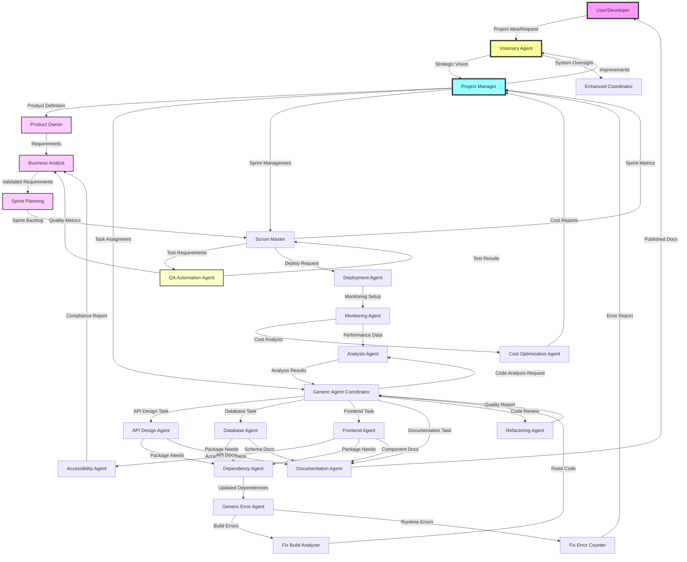

# ZeroDev/BuildFixAgents - Complete Agent Guide

## Table of Contents
1. [Overview](#overview)
2. [Agent Architecture](#agent-architecture)
3. [Core Agents](#core-agents)
4. [Specialized Development Agents](#specialized-development-agents)
5. [Quality & Optimization Agents](#quality--optimization-agents)
6. [Infrastructure & Operations Agents](#infrastructure--operations-agents)
7. [Agent Communication](#agent-communication)
8. [Usage Examples](#usage-examples)
9. [Best Practices](#best-practices)
10. [Troubleshooting](#troubleshooting)

## Overview

The ZeroDev/BuildFixAgents system is a comprehensive multi-agent AI development platform that automates various aspects of software development, from initial project creation to deployment and optimization. Each agent specializes in specific tasks while working together to create a complete development ecosystem.

### Key Features
- **Autonomous Operation**: Agents can work independently or collaboratively
- **Natural Language Interface**: Describe what you want, agents handle implementation
- **Self-Improving**: System learns from each interaction and improves over time
- **Full Stack Coverage**: From database design to frontend, deployment to monitoring

## Agent Architecture

### Hierarchical Structure
```
Level 4: Visionary Agents
├── visionary_agent_buildfix.sh - Strategic system oversight
└── project_manager_agent.sh - Project coordination and planning

Level 3: Coordinator Agents
├── generic_agent_coordinator.sh - Multi-agent orchestration
├── scrum_master_agent.sh - Sprint and task management
└── enhanced_coordinator.sh - Advanced coordination logic

Level 2: Specialist Agents
├── documentation_agent.sh - Documentation generation
├── database_agent.sh - Database design and management
├── api_design_agent.sh - API specification and design
├── frontend_agent.sh - UI component generation
├── monitoring_agent.sh - Observability setup
├── deployment_agent.sh - CI/CD and deployment
├── refactoring_agent.sh - Code quality improvement
├── dependency_agent.sh - Package management
├── accessibility_agent.sh - WCAG compliance
├── analysis_agent.sh - Codebase analysis
├── cost_optimization_agent.sh - Cloud cost reduction
├── product_owner_agent.sh - Product vision and requirements
├── business_analyst_agent.sh - Requirements analysis
├── sprint_planning_agent.sh - Sprint and backlog management
├── qa_automation_agent.sh - Automated testing with Playwright

Level 1: Fix Agents
├── generic_error_agent.sh - General error resolution
├── fix_agent_buildanalyzer.sh - Build analysis fixes
└── fix_agent_errorcounting.sh - Error tracking fixes
```

### Agent Interaction Flow Chart



### ASCII Flow Diagram (Terminal-Friendly)

```
┌─────────────────┐
│  User/Developer │
└────────┬────────┘
         │ Project Idea
         ▼
┌─────────────────┐     ┌──────────────────┐
│ Visionary Agent │────▶│  Project Manager │
└─────────────────┘     └─────────┬────────┘
                                  │
        ┌─────────────────────────┴─────────────────────────┐
        │                                                   │
        ▼                                                   ▼
┌─────────────────┐                              ┌──────────────────┐
│  Product Owner  │                              │ Agent Coordinator│
└────────┬────────┘                              └─────────┬────────┘
         │                                                  │
         ▼                                                  │
┌─────────────────┐                    ┌────────────────────┴────────────────────┐
│Business Analyst │                    │                                         │
└────────┬────────┘                    ▼            ▼            ▼              ▼
         │                      ┌──────────┐  ┌──────────┐  ┌──────────┐  ┌──────────┐
         ▼                      │   API    │  │ Database │  │ Frontend │  │   Docs   │
┌─────────────────┐             │  Agent   │  │  Agent   │  │  Agent   │  │  Agent   │
│ Sprint Planning │             └─────┬────┘  └─────┬────┘  └─────┬────┘  └──────────┘
└────────┬────────┘                   │             │             │
         │                            └─────────────┴─────────────┘
         ▼                                          │
┌─────────────────┐                                ▼
│  Scrum Master   │                       ┌─────────────────┐
└────────┬────────┘                       │ Dependency Agent│
         │                                └─────────────────┘
         ▼                                          │
┌─────────────────┐                                ▼
│  QA Automation  │                       ┌─────────────────┐
└────────┬────────┘                       │  Error Agents   │
         │                                └─────────────────┘
         ▼                                          │
┌─────────────────┐                                ▼
│   Deployment    │                       ┌─────────────────┐
│     Agent       │─────────────────────▶│ Monitoring Agent│
└─────────────────┘                       └─────────────────┘
```

### Detailed Agent Interactions

#### 1. Project Initialization Flow
```
User → Visionary Agent → Project Manager → Product Owner
                      ↓
                Generic Agent Coordinator
                      ↓
        Project Generator Agent → Git Init
                      ↓
              Documentation Agent
```

#### 2. Feature Development Flow
```
Product Owner → Business Analyst → Sprint Planning
                      ↓
               Scrum Master
                      ↓
         Generic Agent Coordinator
              ↓       ↓       ↓
        API Agent  DB Agent  Frontend Agent
              ↓       ↓       ↓
         Dependency Agent (shared)
                      ↓
              QA Automation Agent
                      ↓
             Deployment Agent
```

#### 3. Error Resolution Flow
```
Build/Runtime Error → Generic Error Agent
                           ↓
                    Error Analysis
                     ↓         ↓
            Build Analyzer  Error Counter
                     ↓         ↓
              Fix Generation
                     ↓
            Code Update & Test
                     ↓
              Monitoring Agent
```

#### 4. Quality Assurance Flow
```
Code Changes → Refactoring Agent
                     ↓
            Code Quality Check
                     ↓
           Accessibility Agent
                     ↓
          QA Automation Agent
                     ↓
         Test Suite Execution
                     ↓
          Monitoring Agent
```

#### 5. Business Development Flow
```
User Idea → Product Owner Agent
                  ↓
         Vision & Requirements
                  ↓
        Business Analyst Agent
                  ↓
      Requirements Validation
                  ↓
       Sprint Planning Agent
                  ↓
         Sprint Execution
                  ↓
        Feedback Loop Agent
```

### Communication Patterns

#### Synchronous Communication
- Direct agent-to-agent calls for immediate responses
- Used for: Error fixes, dependency resolution, validation

#### Asynchronous Communication
- State files and message queues for non-blocking operations
- Used for: Long-running tasks, batch processing, reports

#### Event-Driven Communication
- Agents subscribe to events from other agents
- Used for: Monitoring, alerts, status updates

#### Shared State Management
- Central state directory for cross-agent data
- Used for: Project context, metrics, configurations

## Core Agents

### 1. Project Generator Agent (`project_generator_agent.sh`)
Creates complete projects from natural language descriptions.

**Usage:**
```bash
./project_generator_agent.sh --description "Create a task management app with user authentication"
```

**Features:**
- Generates project structure
- Creates boilerplate code
- Sets up configuration files
- Initializes git repository
- Adds appropriate .gitignore

**Example Output:**
```
my-task-app/
├── src/
│   ├── components/
│   ├── services/
│   └── utils/
├── tests/
├── package.json
├── README.md
└── .gitignore
```

### 2. Feature Implementation Agent (`feature_implementation_agent.sh`)
Adds new features to existing projects.

**Usage:**
```bash
./feature_implementation_agent.sh --feature "Add email notifications when tasks are due" --context node
```

**Capabilities:**
- Analyzes existing codebase
- Generates feature code
- Integrates with existing architecture
- Updates tests and documentation

### 3. Build Checker Agent (`build_checker_agent.sh`)
Monitors and ensures build health.

**Usage:**
```bash
./build_checker_agent.sh build
```

**Functions:**
- Runs build commands
- Detects build errors
- Counts unique errors
- Triggers fix agents when needed

## Specialized Development Agents

### 4. Documentation Agent (`documentation_agent.sh`)
Comprehensive documentation generator.

**Commands:**
```bash
# Generate complete documentation
./documentation_agent.sh init

# Generate specific docs
./documentation_agent.sh readme "MyProject" "Project description"
./documentation_agent.sh api docs/api
./documentation_agent.sh guide docs/USER_GUIDE.md
```

**Generates:**
- README.md with badges and sections
- API documentation from code
- User guides
- Code documentation
- Changelog updates

### 5. Database Agent (`database_agent.sh`)
Database design and management.

**Commands:**
```bash
# Generate database schema
./database_agent.sh schema postgresql myapp "users,posts,comments"

# Create migration
./database_agent.sh migration add_user_roles

# Generate connection code
./database_agent.sh connection postgresql javascript
```

**Supports:**
- PostgreSQL, MySQL, MongoDB, SQLite
- Schema generation with relationships
- Migration files
- Connection boilerplate
- Query optimization suggestions

### 6. API Design Agent (`api_design_agent.sh`)
Creates API specifications and contracts.

**Commands:**
```bash
# Generate OpenAPI spec
./api_design_agent.sh openapi "UserAPI" "1.0.0"

# Generate client SDK
./api_design_agent.sh sdk javascript

# Create mock server
./api_design_agent.sh mock
```

**Features:**
- OpenAPI 3.0 specifications
- Client SDK generation (JS, Python, C#)
- Contract testing setup
- Mock server implementation
- GraphQL schema generation

### 7. Frontend Agent (`frontend_agent.sh`)
UI component and layout generator.

**Commands:**
```bash
# Generate React component
./frontend_agent.sh component UserProfile functional

# Create form with validation
./frontend_agent.sh form ContactForm

# Generate complete layout
./frontend_agent.sh layout MainLayout

# Create style system
./frontend_agent.sh styles
```

**Generates:**
- Accessible components
- Form handling with validation
- Responsive layouts
- CSS/styling systems
- Component tests

### 8. Deployment Agent (`deployment_agent.sh`)
CI/CD and deployment automation.

**Commands:**
```bash
# Generate Dockerfile
./deployment_agent.sh dockerfile node

# Create Kubernetes manifests
./deployment_agent.sh k8s myapp production

# Setup GitHub Actions
./deployment_agent.sh github node

# Generate Terraform config
./deployment_agent.sh terraform aws
```

**Provides:**
- Multi-stage Dockerfiles
- Kubernetes deployments with HPA
- CI/CD pipelines
- Infrastructure as Code
- Deployment scripts

### 9. Monitoring Agent (`monitoring_agent.sh`)
Observability and monitoring setup.

**Commands:**
```bash
# Setup logging
./monitoring_agent.sh logging javascript

# Configure metrics
./monitoring_agent.sh metrics

# Create alerts
./monitoring_agent.sh alerts

# Setup distributed tracing
./monitoring_agent.sh tracing
```

**Implements:**
- Structured logging (Winston, Serilog)
- Prometheus metrics
- Grafana dashboards
- AlertManager rules
- Distributed tracing (Jaeger)
- Health check endpoints

## Quality & Optimization Agents

### 10. Refactoring Agent (`refactoring_agent.sh`)
Code quality analysis and improvement.

**Commands:**
```bash
# Analyze code complexity
./refactoring_agent.sh analyze ./src

# Generate refactoring suggestions
./refactoring_agent.sh suggest

# Generate ESLint config
./refactoring_agent.sh lint
```

**Analyzes:**
- Cyclomatic complexity
- Code smells
- Long functions/classes
- Duplicate code
- Technical debt

### 11. Dependency Agent (`dependency_agent.sh`)
Package and security management.

**Commands:**
```bash
# Security audit
./dependency_agent.sh audit

# Check outdated packages
./dependency_agent.sh outdated

# Generate update script
./dependency_agent.sh update npm safe

# License compliance
./dependency_agent.sh licenses
```

**Features:**
- Vulnerability scanning
- Update recommendations
- License compliance checking
- Dependency graph visualization
- Security policy generation

### 12. Accessibility Agent (`accessibility_agent.sh`)
WCAG compliance and a11y improvements.

**Commands:**
```bash
# Generate accessible components
./accessibility_agent.sh component modal

# Create ARIA patterns guide
./accessibility_agent.sh aria

# Generate test suite
./accessibility_agent.sh test

# Compliance checklist
./accessibility_agent.sh checklist
```

**Ensures:**
- WCAG 2.1 Level AA compliance
- Keyboard navigation
- Screen reader support
- Color contrast requirements
- Accessible forms and modals

### 13. Analysis Agent (`analysis_agent.sh`)
Comprehensive codebase insights.

**Commands:**
```bash
# Full analysis
./analysis_agent.sh full

# Structure analysis
./analysis_agent.sh structure

# Code metrics
./analysis_agent.sh metrics

# Technical debt report
./analysis_agent.sh tech-debt
```

**Provides:**
- Codebase structure analysis
- Language distribution
- Complexity metrics
- Architecture pattern detection
- Tech debt quantification

### 14. Cost Optimization Agent (`cost_optimization_agent.sh`)
Cloud cost analysis and reduction.

**Commands:**
```bash
# Analyze cloud resources
./cost_optimization_agent.sh analyze aws

# Generate recommendations
./cost_optimization_agent.sh recommend

# Setup budget alerts
./cost_optimization_agent.sh budgets

# Cost dashboard
./cost_optimization_agent.sh dashboard
```

**Optimizes:**
- Right-sizing recommendations
- Spot instance opportunities
- Reserved instance planning
- Unused resource cleanup
- Auto-scaling configuration

## Business Development Agents

### 15. Product Owner Agent (`product_owner_agent.sh`)
Transforms business ideas into product vision and requirements.

**Commands:**
```bash
# Create product vision from idea
./product_owner_agent.sh vision "AI-powered task management app"

# Generate user personas
./product_owner_agent.sh personas

# Define requirements
./product_owner_agent.sh requirements

# Competitive analysis
./product_owner_agent.sh competitive

# Go-to-market strategy
./product_owner_agent.sh gtm
```

**Creates:**
- Product vision documents
- User personas and journey maps
- Product requirements (PRD)
- Market analysis
- Success metrics

### 16. Business Analyst Agent (`business_analyst_agent.sh`)
Analyzes and validates business requirements.

**Commands:**
```bash
# Analyze requirements
./business_analyst_agent.sh analyze

# Create specifications
./business_analyst_agent.sh specify authentication

# Validate acceptance criteria
./business_analyst_agent.sh validate

# Create feedback mechanisms
./business_analyst_agent.sh feedback

# Generate process flows
./business_analyst_agent.sh flow user_registration
```

**Delivers:**
- Requirements analysis
- Detailed specifications
- Acceptance criteria validation
- Process flow diagrams
- Gap analysis

### 17. Sprint Planning Agent (`sprint_planning_agent.sh`)
Creates and manages development sprints.

**Commands:**
```bash
# Create sprint plan
./sprint_planning_agent.sh create 1 2 40

# Manage product backlog
./sprint_planning_agent.sh backlog

# Update sprint progress
./sprint_planning_agent.sh update 1 25

# Generate sprint report
./sprint_planning_agent.sh report 1

# Create release plan
./sprint_planning_agent.sh release 1.0
```

**Manages:**
- Sprint planning and backlog
- Story point estimation
- Velocity tracking
- Sprint reports
- Release planning

### 18. QA Automation Agent (`qa_automation_agent.sh`)
Creates automated tests using Playwright and other frameworks.

**Commands:**
```bash
# Initialize test framework
./qa_automation_agent.sh init playwright

# Generate E2E tests
./qa_automation_agent.sh e2e authentication

# Create API tests
./qa_automation_agent.sh api

# Generate mobile tests
./qa_automation_agent.sh mobile

# Run specific test suite
./qa_automation_agent.sh run smoke
```

**Test Coverage:**
- End-to-end testing with Playwright
- API testing with assertions
- Mobile testing (iOS/Android)
- Performance testing
- Security testing
- Accessibility testing

### 19. User Story Agent (`user_story_agent.sh`)
Creates and manages user stories with proper formatting.

**Commands:**
```bash
# Create user story
./user_story_agent.sh create feature user "perform action" "achieve goal"

# Create epic
./user_story_agent.sh epic "New Feature" "Business value"

# Generate from requirement
./user_story_agent.sh generate "User needs to log in"

# Split large story
./user_story_agent.sh split US-001 3

# Analyze story quality
./user_story_agent.sh analyze
```

**Deliverables:**
- User stories in standard format
- Acceptance criteria
- Story estimation
- Epic management
- Quality analysis

### 20. Requirements Agent (`requirements_agent.sh`)
Gathers and manages all types of requirements.

**Commands:**
```bash
# Gather requirements
./requirements_agent.sh gather interview

# Create traceability matrix
./requirements_agent.sh trace

# Analyze completeness
./requirements_agent.sh analyze

# Generate documentation
./requirements_agent.sh document comprehensive

# Validate consistency
./requirements_agent.sh validate
```

**Manages:**
- Functional requirements
- Non-functional requirements
- Technical requirements
- Traceability matrix
- Validation reports

### 21. Roadmap Agent (`roadmap_agent.sh`)
Creates product roadmaps with timeline visualization.

**Commands:**
```bash
# Create roadmap
./roadmap_agent.sh create 12 "Product Name"

# Create milestone
./roadmap_agent.sh milestone "MVP Launch" "2024-06-01"

# Generate release notes
./roadmap_agent.sh release 1.0.0

# Create status report
./roadmap_agent.sh report

# Create visual roadmap
./roadmap_agent.sh visual 12
```

**Features:**
- Timeline visualization
- Milestone tracking
- Release planning
- Progress reporting
- Resource planning

### 22. Feedback Loop Agent (`feedback_loop_agent.sh`)
Manages continuous feedback collection and integration.

**Commands:**
```bash
# Collect feedback
./feedback_loop_agent.sh collect user performance

# Analyze patterns
./feedback_loop_agent.sh analyze

# Create action items
./feedback_loop_agent.sh action high

# Generate report
./feedback_loop_agent.sh report weekly

# Close feedback loop
./feedback_loop_agent.sh close FB-001
```

**Capabilities:**
- Feedback collection
- Pattern analysis
- Sentiment analysis
- Action item generation
- Loop closure tracking

## Agent Communication

### State Management
All agents share state through the `state/` directory:
```
state/
├── agent_specifications.json - Agent task definitions
├── error_analysis.json - Current error states
├── project_status.json - Overall project status
└── [agent_name]/ - Agent-specific state
```

### Message Passing
Agents communicate through:
1. **JSON state files** - Persistent state
2. **Environment variables** - Runtime configuration
3. **Return codes** - Success/failure status
4. **Log events** - Using enhanced logging system

### Coordination Protocol
```bash
# Coordinator assigns task
echo '{"agent": "database_agent", "task": "create_schema"}' > state/current_task.json

# Agent picks up task
task=$(jq -r '.task' state/current_task.json)

# Agent reports completion
echo '{"status": "completed", "output": "schema.sql"}' > state/task_result.json
```

## Usage Examples

### Example 1: Create Full-Stack Application
```bash
# 1. Generate project
./project_generator_agent.sh --description "E-commerce platform with user reviews"

# 2. Setup database
cd my-ecommerce-app
../database_agent.sh init

# 3. Design API
../api_design_agent.sh init

# 4. Create frontend components
../frontend_agent.sh init

# 5. Setup monitoring
../monitoring_agent.sh init

# 6. Configure deployment
../deployment_agent.sh init
```

### Example 2: Add Feature to Existing Project
```bash
# 1. Analyze current structure
./analysis_agent.sh full

# 2. Add authentication feature
./feature_implementation_agent.sh --feature "Add OAuth2 authentication"

# 3. Update documentation
./documentation_agent.sh readme

# 4. Check accessibility
./accessibility_agent.sh init

# 5. Setup deployment
./deployment_agent.sh docker
```

### Example 3: Optimize Existing Application
```bash
# 1. Analyze code quality
./refactoring_agent.sh analyze

# 2. Check dependencies
./dependency_agent.sh audit

# 3. Analyze costs
./cost_optimization_agent.sh init

# 4. Implement monitoring
./monitoring_agent.sh init

# 5. Generate reports
./analysis_agent.sh tech-debt
```

## Best Practices

### 1. Agent Selection
- Use high-level agents (project_generator, feature_implementation) for complex tasks
- Use specific agents for targeted improvements
- Let coordinators handle multi-agent workflows

### 2. State Management
- Always check agent state before running
- Clean state directory for fresh runs
- Backup state before major operations

### 3. Error Handling
- Monitor agent logs in `state/logs/`
- Check error counts before proceeding
- Use fix agents for automatic resolution

### 4. Performance
- Run analysis agents first to understand codebase
- Use parallel execution for independent tasks
- Cache results when possible

### 5. Integration
- Commit generated code to version control
- Review agent output before production use
- Integrate with existing CI/CD pipelines

## Troubleshooting

### Common Issues

#### 1. Agent Not Found
```bash
# Error: ./agent.sh: No such file or directory
# Solution: Ensure you're in BuildFixAgents directory
cd /path/to/BuildFixAgents
```

#### 2. Permission Denied
```bash
# Error: Permission denied
# Solution: Make scripts executable
chmod +x *.sh
```

#### 3. State Conflicts
```bash
# Error: State file locked
# Solution: Clear state and retry
rm -f state/.lock
```

#### 4. Dependency Issues
```bash
# Error: jq: command not found
# Solution: Install required dependencies
sudo apt-get install jq  # Ubuntu/Debian
brew install jq          # macOS
```

### Debug Mode
Enable verbose logging:
```bash
export DEBUG=true
export LOG_LEVEL=debug
./agent_name.sh command
```

### Getting Help
1. Check agent help: `./agent_name.sh help`
2. Review logs: `cat state/logs/agent_name.log`
3. Check state: `cat state/agent_name/state.json`
4. Report issues: Create issue in repository

## Advanced Topics

### Custom Agent Development
To create a new agent:
1. Copy template: `cp template_agent.sh my_agent.sh`
2. Define agent capabilities
3. Implement command functions
4. Add state management
5. Register with coordinator

### Agent Plugins
Extend agents with plugins:
```bash
# Load plugin
source plugins/my_plugin.sh

# Use plugin functions
my_plugin_function
```

### Multi-Environment Support
Configure for different environments:
```bash
export ENVIRONMENT=production
export CLOUD_PROVIDER=aws
./deployment_agent.sh init
```

## Conclusion

The ZeroDev/BuildFixAgents system provides a comprehensive toolkit for modern software development. By leveraging specialized agents, developers can:

- Accelerate development cycles
- Maintain consistent code quality
- Automate repetitive tasks
- Focus on business logic
- Ensure best practices

For the latest updates and contributions, visit the [BuildFixAgents repository](https://github.com/your-org/BuildFixAgents).