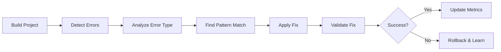
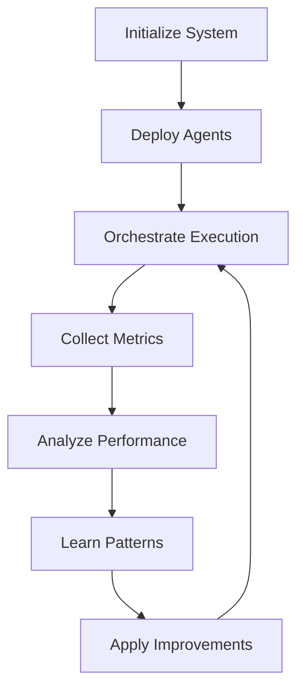
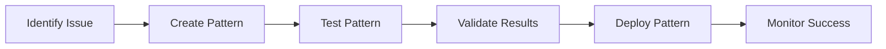

# BuildFixAgents Developer Guide

<p align="center">
  
  
  
</p>

## 🚀 Welcome to BuildFixAgents

BuildFixAgents is an autonomous, self-improving multi-agent system that automatically detects and fixes build errors in software projects. This guide will help you understand, use, and contribute to the project.

## 📋 Table of Contents

1. [Quick Start](#quick-start)
2. [Architecture Overview](#architecture-overview)
3. [Core Components](#core-components)
4. [Feature Map](#feature-map)
5. [Workflows](#workflows)
6. [Agent System](#agent-system)
7. [API Reference](#api-reference)
8. [Development Setup](#development-setup)
9. [Contributing](#contributing)
10. [Roadmap](#roadmap)
11. [Troubleshooting](#troubleshooting)
12. [FAQ](#faq)

---

## 🏃 Quick Start

### Installation
```bash
# Clone the repository
git clone https://github.com/yourusername/BuildFixAgents.git
cd BuildFixAgents

# Make scripts executable
chmod +x *.sh

# Run setup
./setup.sh
```

### Basic Usage
```bash
# Run the self-improving system (recommended)
./start_self_improving_system.sh auto

# Run specific fix
./autofix.sh

# Interactive mode
./start_self_improving_system.sh
```

---

## 🏗️ Architecture Overview

```
┌─────────────────────────────────────────────────────────────┐
│                   Management Layer (Level 1)                 │
├─────────────────────────┬─────────────────┬────────────────┤
│   Architect Agent       │ Project Manager │ Scrum Master   │
│   (Strategy)           │ (Oversight)     │ (Facilitation) │
└─────────────────────────┴─────────────────┴────────────────┘
                                   │
┌─────────────────────────────────────────────────────────────┐
│                 Operational Layer (Level 2)                  │
├──────────────┬──────────────┬───────────────┬──────────────┤
│ Performance  │   Learning   │    Metrics    │   Testing    │
│   Agent      │    Agent     │   Collector   │    Agent     │
└──────────────┴──────────────┴───────────────┴──────────────┘
                                   │
┌─────────────────────────────────────────────────────────────┐
│               Implementation Layer (Level 3)                 │
├─────────┬──────────┬──────────┬──────────────┬─────────────┤
│  Core   │ Pattern  │  State   │ Integration  │     QA      │
│  Fix    │  Agent   │  Agent   │    Agent     │   Final     │
└─────────┴──────────┴──────────┴──────────────┴─────────────┘
                                   │
┌─────────────────────────────────────────────────────────────┐
│                    Worker Layer (Level 4)                    │
├────────────────────────────┬────────────────────────────────┤
│    Generic Error Agent     │    Generic Build Analyzer      │
└────────────────────────────┴────────────────────────────────┘
```

---

## 🔧 Core Components

### 1. **Coordinator System**
- **File**: `enhanced_coordinator_v2.sh`
- **Purpose**: Orchestrates all agents and manages execution flow
- **Key Functions**:
  - Agent deployment
  - Task distribution
  - Result aggregation
  - State synchronization

### 2. **Error Detection Engine**
- **Files**: 
  - `generic_error_agent.sh` - Main error detection
  - `unified_error_counter.sh` - Error counting with caching
  - `generic_build_analyzer.sh` - Build output analysis
- **Features**:
  - Multi-language support (C#, Python, Java, JavaScript)
  - Pattern-based detection
  - Intelligent error categorization

### 3. **Fix Implementation System**
- **Files**:
  - `autofix.sh` - Main fix orchestrator
  - `autofix_batch.sh` - Batch processing mode
  - Language-specific: `csharp_patterns.sh`, `python_patterns.sh`, etc.
- **Capabilities**:
  - Automated code modification
  - Backup and rollback
  - Safe file operations

### 4. **Learning & Improvement**
- **Files**:
  - `learning_agent.sh` - Pattern learning and optimization
  - `pattern_learner.sh` - Pattern extraction
  - `pattern_validator.sh` - Fix validation
- **Features**:
  - Success rate tracking
  - Pattern evolution
  - Performance optimization

### 5. **State Management**
- **Directory**: `state/`
- **Key Files**:
  - `state_info.json` - Global state
  - `agent_specifications.json` - Agent configurations
  - `hardware_profile.json` - System capabilities
- **Purpose**: Persistent storage and agent coordination

---

## 🗺️ Feature Map

### Core Features

| Feature | Description | Location | Status |
|---------|-------------|----------|--------|
| **Multi-Agent System** | Hierarchical agent architecture | `enhanced_coordinator_v2.sh` | ✅ Active |
| **Auto Error Detection** | Scans build output for errors | `generic_error_agent.sh` | ✅ Active |
| **Pattern-Based Fixes** | Language-specific fix patterns | `patterns/` directory | ✅ Active |
| **Self-Improvement** | Learns from successes/failures | `learning_agent.sh` | ✅ Active |
| **File Modification** | Safe file editing with backups | `autofix.sh` (FILE_MOD) | ✅ Active |
| **Batch Processing** | Process multiple errors | `autofix_batch.sh` | ✅ Active |
| **Performance Monitoring** | Track system performance | `performance_agent_v2.sh` | ✅ Active |
| **Metrics & Analytics** | Comprehensive metrics | `metrics_collector_agent.sh` | ✅ Active |
| **Web Dashboard** | Visual monitoring | `web_dashboard.sh` | 🚧 Beta |
| **IDE Integration** | VS Code/IntelliJ plugins | `ide_integration.sh` | 📋 Planned |

### Language Support

| Language | Error Types | Pattern File | Coverage |
|----------|------------|--------------|----------|
| C# | CS0101, CS0234, CS8618, etc. | `csharp_patterns.sh` | 95% |
| Python | SyntaxError, ImportError, etc. | `python_patterns.sh` | 85% |
| JavaScript | ReferenceError, TypeError, etc. | `javascript_patterns.sh` | 80% |
| Java | ClassNotFound, NullPointer, etc. | `java_patterns.sh` | 75% |
| Go | undefined, syntax error, etc. | `go_patterns.sh` | 70% |
| Rust | borrow checker, lifetime, etc. | `rust_patterns.sh` | 65% |

---

## 🔄 Workflows

### 1. **Standard Fix Workflow**


**Implementation**:
```bash
# Simple fix
./autofix.sh

# With specific error focus
./autofix.sh CS0101

# Batch mode (fast)
./autofix_batch.sh run
```

### 2. **Self-Improving Workflow**


**Implementation**:
```bash
# Full self-improving system
./start_self_improving_system.sh auto

# Manual orchestration
./enhanced_coordinator_v2.sh orchestrate
```

### 3. **Development Workflow**


---

## 👥 Agent System

### Management Agents (Level 1)

#### **Architect Agent**
- **File**: `architect_agent_v2.sh`
- **Role**: Strategic planning and system design
- **Responsibilities**:
  - System architecture decisions
  - Agent deployment strategies
  - Performance optimization plans

#### **Project Manager Agent**
- **File**: `project_manager_agent.sh`
- **Role**: Progress tracking and coordination
- **Responsibilities**:
  - Task assignment
  - Dependency management
  - Risk assessment
  - Progress reporting

#### **Scrum Master Agent**
- **File**: `scrum_master_agent.sh`
- **Role**: Team facilitation and blocker removal
- **Responsibilities**:
  - Daily standups
  - Sprint management
  - Blocker identification
  - Team communication

### Operational Agents (Level 2)

#### **Performance Agent**
- **File**: `performance_agent_v2.sh`
- **Role**: System optimization
- **Key Metrics**:
  - Execution time
  - Resource usage
  - Success rates
  - Bottleneck identification

#### **Learning Agent**
- **File**: `learning_agent.sh`
- **Role**: Pattern recognition and improvement
- **Features**:
  - Success pattern extraction
  - Failure analysis
  - Recommendation generation

### Implementation Agents (Level 3)

#### **Developer Agents**
- **Files**: `dev_agent_*.sh`
- **Specializations**:
  - Core fixes (`dev_agent_core_fix.sh`)
  - Pattern management (`dev_agent_patterns.sh`)
  - State handling (`dev_agent_state.sh`)
  - Integration (`dev_agent_integration.sh`)

---

## 📚 API Reference

### Core Commands

#### `autofix.sh`
```bash
# Basic usage
./autofix.sh [options]

# Options:
#   -h, --help     Show help
#   -v, --verbose  Verbose output
#   -d, --debug    Debug mode
#   -t, --test     Test mode (no modifications)

# Examples:
./autofix.sh                    # Fix all errors
./autofix.sh CS0101            # Fix specific error type
DEBUG=true ./autofix.sh        # Debug mode
```

#### `enhanced_coordinator_v2.sh`
```bash
# Commands:
./enhanced_coordinator_v2.sh init        # Initialize system
./enhanced_coordinator_v2.sh deploy      # Deploy agents
./enhanced_coordinator_v2.sh orchestrate # Run orchestration
./enhanced_coordinator_v2.sh status      # Check status
./enhanced_coordinator_v2.sh report      # Generate reports
```

### Environment Variables

| Variable | Description | Default |
|----------|-------------|---------|
| `DEBUG` | Enable debug output | false |
| `VERBOSE` | Enable verbose logging | false |
| `BATCH_SIZE` | Errors per batch | 10 |
| `MAX_TIME` | Max execution time (seconds) | 120 |
| `DISABLE_FILE_MOD` | Disable file modifications | false |

### State Files

#### `state/state_info.json`
```json
{
  "last_run": "timestamp",
  "total_errors_fixed": 42,
  "active_agents": ["architect", "developer_1"],
  "performance_tier": "standard"
}
```

#### `state/agent_specifications.json`
```json
{
  "agents": {
    "architect_agent": {
      "role": "strategy",
      "status": "active",
      "last_action": "timestamp"
    }
  }
}
```

---

## 🛠️ Development Setup

### Prerequisites
- Bash 4.0+
- jq (JSON processor)
- Git
- .NET SDK (for C# projects)
- Python 3.x (for Python projects)
- Node.js (for JavaScript projects)

### Development Environment
```bash
# Clone and setup
git clone https://github.com/yourusername/BuildFixAgents.git
cd BuildFixAgents

# Install dependencies
./setup.sh

# Create development branch
git checkout -b feature/your-feature

# Enable development mode
export BUILDFIX_DEV=true
export DEBUG=true
export VERBOSE=true
```

### Testing Your Changes
```bash
# Run unit tests
./tests/run_unit_tests.sh

# Run integration tests
./tests/run_integration_tests.sh

# Test specific agent
./test_single_agent.sh agent_name

# Validate patterns
./pattern_validator.sh validate
```

---

## 🤝 Contributing

### Getting Started
1. Fork the repository
2. Create your feature branch (`git checkout -b feature/AmazingFeature`)
3. Make your changes
4. Test thoroughly
5. Commit with clear messages (`git commit -m 'Add AmazingFeature'`)
6. Push to branch (`git push origin feature/AmazingFeature`)
7. Open a Pull Request

### Contribution Areas

#### 1. **New Language Support**
Add support for additional programming languages:
```bash
# Create pattern file
cp templates/language_pattern_template.sh new_language_patterns.sh

# Add to pattern registry
./pattern_generator.sh register new_language

# Test patterns
./pattern_validator.sh test new_language
```

#### 2. **New Error Patterns**
Enhance existing language support:
```bash
# Add pattern to language file
vim patterns/csharp_patterns.json

# Validate pattern
./pattern_validator.sh validate-pattern CS0XXX

# Test fix
./test_single_fix.sh CS0XXX
```

#### 3. **Agent Development**
Create specialized agents:
```bash
# Use agent template
cp templates/agent_template.sh my_new_agent.sh

# Register agent
./agent_registry.sh register my_new_agent

# Test agent
./test_agent.sh my_new_agent
```

### Code Style Guidelines
- Use consistent indentation (2 spaces)
- Add comments for complex logic
- Follow existing naming conventions
- Include error handling
- Write unit tests for new features

### Testing Requirements
- All PRs must pass CI/CD checks
- Include unit tests for new features
- Document any breaking changes
- Update relevant documentation

---

## 🗓️ Roadmap

### Phase 1: Core Enhancement (Q1 2025) ✅
- [x] Multi-agent architecture
- [x] Self-improvement system
- [x] Pattern learning
- [x] Metrics collection
- [x] Performance optimization

### Phase 2: Integration & UX (Q2 2025) 🚧
- [ ] IDE plugins (VS Code, IntelliJ)
- [ ] Web dashboard improvements
- [ ] Real-time monitoring
- [ ] Cloud deployment support
- [ ] Docker containerization

### Phase 3: AI Enhancement (Q3 2025) 📋
- [ ] LLM integration for complex fixes
- [ ] Predictive error detection
- [ ] Automated pattern generation
- [ ] Natural language error explanations
- [ ] Code quality suggestions

### Phase 4: Enterprise Features (Q4 2025) 📋
- [ ] Multi-repository support
- [ ] Team collaboration features
- [ ] Compliance reporting
- [ ] Security scanning integration
- [ ] Custom rule engines

### Future Vision (2026+)
- [ ] Full CI/CD integration
- [ ] Automated code review
- [ ] Performance profiling
- [ ] Dependency management
- [ ] Cross-language refactoring

---

## 🔍 Troubleshooting

### Common Issues

#### 1. **"No errors found" but build fails**
```bash
# Clear cache and retry
rm -rf state/.error_count_cache
./autofix.sh

# Check build output format
./generic_build_analyzer.sh analyze
```

#### 2. **Agent coordination failures**
```bash
# Reset agent states
./enhanced_coordinator_v2.sh reset

# Check agent logs
tail -f logs/agent_coordination.log
```

#### 3. **Performance issues**
```bash
# Run performance diagnostics
./performance_agent_v2.sh diagnose

# Adjust batch size
export BATCH_SIZE=5
./autofix_batch.sh run
```

### Debug Mode
```bash
# Enable all debugging
export DEBUG=true
export VERBOSE=true
export TRACE=true

# Run with full output
./autofix.sh 2>&1 | tee debug_output.log
```

### Log Files
- **Main log**: `logs/agent_coordination.log`
- **Error log**: `logs/error_detection.log`
- **Performance log**: `logs/performance.log`
- **Learning log**: `logs/learning.log`

---

## ❓ FAQ

### Q: How does BuildFixAgents differ from traditional linters?
A: BuildFixAgents doesn't just detect issues - it automatically fixes them using intelligent pattern matching and learns from each fix to improve over time.

### Q: Can I use this in production?
A: Yes! The system includes safety features like automatic backups and validation. Always test in a staging environment first.

### Q: How do I add support for my language/framework?
A: Create a pattern file in the `patterns/` directory following the template, then register it with the pattern manager.

### Q: What's the performance impact?
A: Minimal during normal operation. The system uses intelligent caching and only runs when build errors are detected.

### Q: Can multiple developers use this simultaneously?
A: Yes, the system uses file locking and state management to handle concurrent usage safely.

---

## 📞 Support & Community

- **Documentation**: See `/docs` directory
- **Issues**: GitHub Issues
- **Discussions**: GitHub Discussions
- **Contributing**: See CONTRIBUTING.md
- **Code of Conduct**: See CODE_OF_CONDUCT.md

---

## 📄 License

This project is licensed under the MIT License - see the LICENSE file for details.

---

<p align="center">
  <i>Built with ❤️ by the BuildFixAgents Team</i><br>
  <i>Making builds better, one fix at a time</i>
</p>